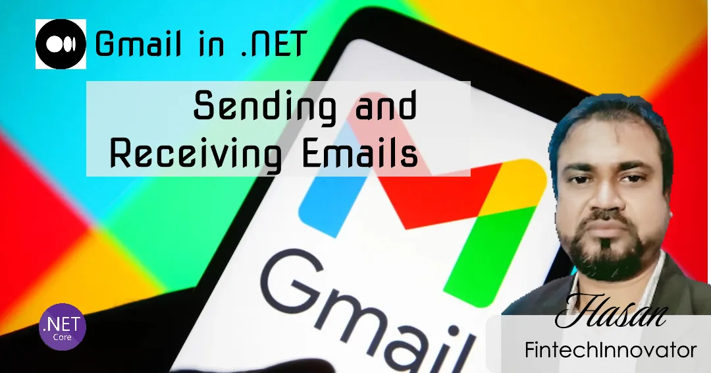

# MimeKit in .NET: Gmail Sending and Receiving Step-by-Step Tutorial
  Learn how to send and receive Gmail emails seamlessly within C# .NET in this step-by-step guide. Discover essential techniques to set up Gmail API, handle authentication, and streamline email communication. Ideal for developers aiming to automate email workflows, this tutorial covers practical tips to enhance productivity by integrating Gmail with C# .NET. Start building efficient email solutions today.

  

  # more details
https://medium.com/@hasanmcse/real-time-web-chat-client-in-net-using-signalr-and-dapper-part-ii-d4bf74a00075?sk=25d4a57d455db26d129912634b61f430
